# CasinoKing - Code Architecture Mermaid Map

Status: ACTIVE  
Last meaningful update: 2026-05-23
Scope: navigational code map for humans. This does not replace `docs/SOURCE_OF_TRUTH.md` or the architecture atlas docs; it is a visual index for finding the right layer quickly.

## How To View It

You do not need to copy diagrams one by one.

Fastest local option on Windows:

1. Open this file in Cursor or VS Code.
2. Press `Ctrl+Shift+V` to open Markdown Preview.
3. The Mermaid diagrams render inline in the preview.

Useful alternatives:

- `Ctrl+K V` opens the preview side-by-side with the markdown source.
- GitHub renders Mermaid automatically when this file is opened in the repository UI.
- Mermaid Live Editor is useful only when editing a single diagram interactively; in that case copy just one `mermaid` block.

## 1. System Overview

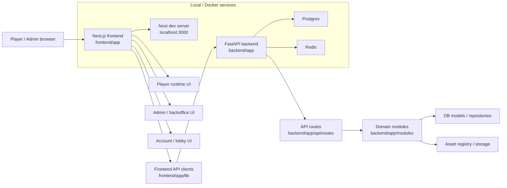

## 2. Frontend Route And UI Ownership

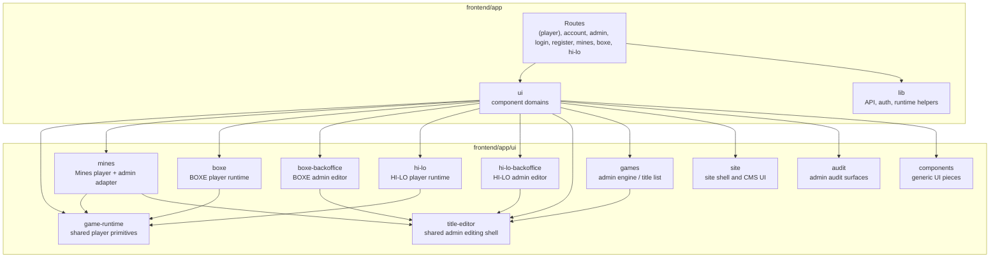

## 3. Player Game Runtime Inheritance

```mermaid
flowchart TB
  subgraph SharedRuntime["frontend/app/ui/game-runtime"]
    Boot["GameBootShell / launch context"]
    TopBar["GameTopBar"]
    Rail["GameControlRail / mobile stack"]
    Bet["GameBetPanel / quick chips / action buttons"]
    Balance["GameBalanceFooter"]
    HTP["GameHowToPlayGate"]
    Info["GameInfoRulesModal"]
    Error["GameActionError / copy adapter"]
    Storage["game-storage / audio preferences"]
  end

  subgraph MinesPlayer["frontend/app/ui/mines"]
    MinesStandalone["mines-standalone.tsx"]
    MinesGameplay["mines-gameplay.tsx"]
    MinesBoard["mines-board.tsx"]
    MinesRules["mines-rules-modal.tsx"]
    MinesReplay["mines-replay-viewer.tsx"]
    MinesI18n["mines-i18n/*"]
  end

  subgraph BoxePlayer["frontend/app/ui/boxe"]
    BoxeStandalone["boxe-standalone.tsx"]
    BoxeGameplay["boxe-gameplay.tsx"]
    Pyramid["boxe-pyramid-board.tsx"]
    Payout["boxe-payout-display.tsx"]
    BoxeRules["boxe-rules-modal.tsx"]
    BoxeReplay["boxe-replay-viewer.tsx"]
    BoxeI18n["boxe-i18n/*"]
  end

  subgraph HiLoPlayer["frontend/app/ui/hi-lo"]
    HiLoStandalone["hi-lo-standalone.tsx"]
    HiLoGameplay["hi-lo-gameplay.tsx"]
    HiLoRuntime["use-hi-lo-runtime.ts"]
    HiLoRules["hi-lo-rules-modal.tsx"]
    HiLoReplay["hi-lo-replay-viewer.tsx"]
    HiLoHowTo["hi-lo-how-to-visual.tsx"]
    HiLoI18n["hi-lo-i18n/*"]
    HiLoCss["hi-lo.css"]
    HiLoAssets["public/game-assets/hi-lo/*"]
  end

  MinesStandalone --> Boot
  MinesStandalone --> TopBar
  MinesStandalone --> HTP
  MinesGameplay --> Rail
  MinesGameplay --> Bet
  MinesGameplay --> Balance
  MinesGameplay --> MinesBoard
  MinesGameplay --> MinesRules
  MinesGameplay --> MinesReplay
  MinesGameplay --> Error
  MinesRules --> Info
  MinesGameplay --> MinesI18n

  BoxeStandalone --> Boot
  BoxeStandalone --> TopBar
  BoxeStandalone --> HTP
  BoxeGameplay --> Rail
  BoxeGameplay --> Bet
  BoxeGameplay --> Balance
  BoxeGameplay --> Pyramid
  BoxeGameplay --> Payout
  BoxeGameplay --> BoxeRules
  BoxeGameplay --> BoxeReplay
  BoxeGameplay --> Error
  BoxeRules --> Info
  BoxeGameplay --> BoxeI18n

  HiLoStandalone --> Boot
  HiLoStandalone --> HTP
  HiLoStandalone --> HiLoHowTo
  HiLoStandalone --> HiLoI18n
  HiLoGameplay --> Rail
  HiLoGameplay --> Bet
  HiLoGameplay --> Balance
  HiLoGameplay --> Error
  HiLoGameplay --> HiLoRules
  HiLoRules --> Info
  HiLoRules --> HiLoI18n
  HiLoGameplay --> HiLoRuntime
  HiLoReplay --> HiLoRuntime
  HiLoGameplay --> HiLoCss
  HiLoReplay --> HiLoCss
  HiLoCss --> HiLoAssets

  RuntimeBoundary["Boundary rule:<br/>game-runtime must not import game UI folders"] -. guards .-> SharedRuntime
  GameBoundary["Game UI folders do not import each other"] -. guards .-> MinesPlayer
  GameBoundary -. guards .-> BoxePlayer
  GameBoundary -. guards .-> HiLoPlayer
```

## 4. Backend Platform And Game Flow

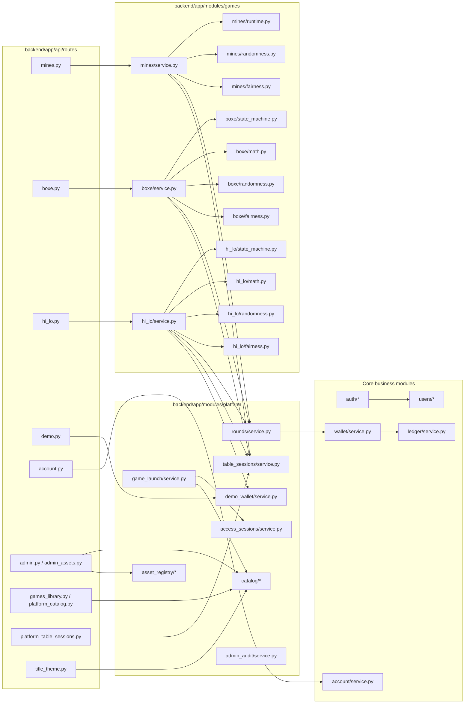

## 5. Backoffice And Title Editor Flow

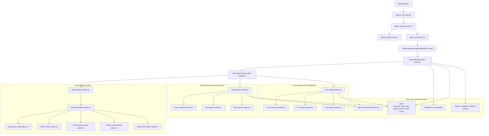

## 6. Admin Backend Services

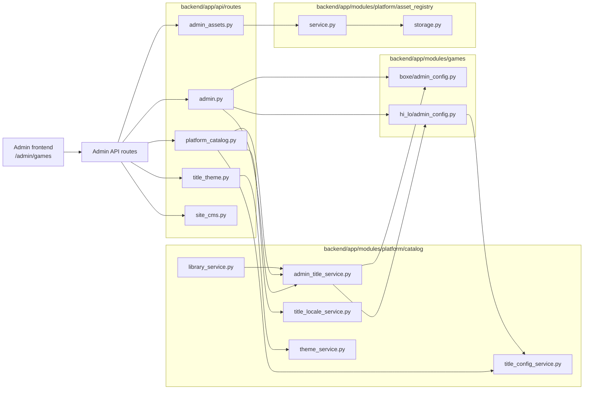

## 7. Persistence Map

```mermaid
flowchart TB
  subgraph DB["Postgres persistence groups"]
    AuthDB["auth / users"]
    MoneyDB["wallet / ledger"]
    CatalogDB["game catalog<br/>titles, variants, site status"]
    TitleDB["title config<br/>copy, theme, assets, sound"]
    SessionDB["access sessions<br/>table sessions"]
    RoundDB["platform rounds<br/>game rounds"]
    MinesDB["Mines-specific state"]
    BoxeDB["BOXE-specific state"]
    HiLoDB["HI-LO-specific state"]
    AuditDB["admin audit / access logs"]
    CMSDB["site CMS"]
  end

  AuthModule["auth + users modules"] --> AuthDB
  WalletModule["wallet + ledger modules"] --> MoneyDB
  CatalogModule["platform/catalog"] --> CatalogDB
  CatalogModule --> TitleDB
  AssetModule["asset_registry"] --> TitleDB
  AccessModule["access_sessions / table_sessions"] --> SessionDB
  RoundsModule["platform/rounds"] --> RoundDB
  MinesModule["games/mines"] --> MinesDB
  BoxeModule["games/boxe"] --> BoxeDB
  HiLoModule["games/hi_lo"] --> HiLoDB
  AuditModule["admin_audit"] --> AuditDB
  SiteModule["site_cms"] --> CMSDB
```

## 8. Main Runtime Request Flow

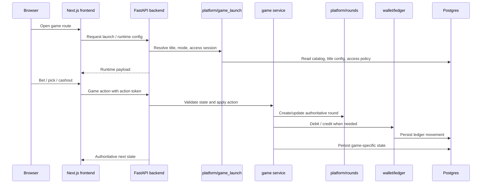

## 9. BOXE-Specific Gameplay Flow

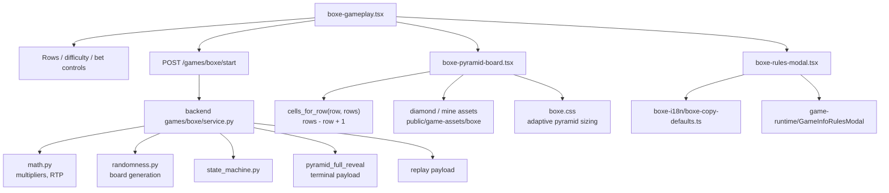

## 10. Guarded Boundaries To Check During Refactors

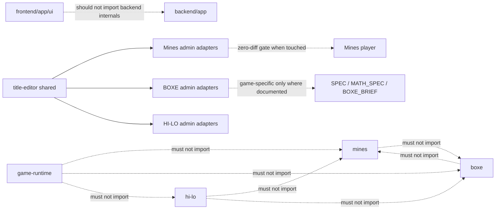

## 11. HI-LO Player Runtime Flow

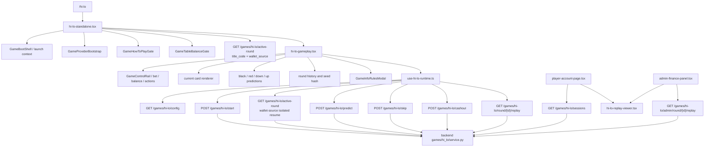

## 12. Quick File Index

| Area | Start here |
| --- | --- |
| Player runtime shared shell | `frontend/app/ui/game-runtime/` |
| Mines player | `frontend/app/ui/mines/mines-standalone.tsx`, `frontend/app/ui/mines/mines-gameplay.tsx` |
| BOXE player | `frontend/app/ui/boxe/boxe-standalone.tsx`, `frontend/app/ui/boxe/boxe-gameplay.tsx` |
| BOXE board | `frontend/app/ui/boxe/boxe-pyramid-board.tsx`, `frontend/app/ui/boxe/boxe.css` |
| HI-LO player | `frontend/app/ui/hi-lo/hi-lo-standalone.tsx`, `frontend/app/ui/hi-lo/hi-lo-gameplay.tsx`, `frontend/app/ui/hi-lo/hi-lo-replay-viewer.tsx`, `frontend/app/ui/hi-lo/use-hi-lo-runtime.ts` |
| Admin engine list | `frontend/app/ui/games/` |
| Shared title editor | `frontend/app/ui/title-editor/` |
| Mines admin editor | `frontend/app/ui/mines/mines-engine-editor.tsx`, `frontend/app/ui/mines/mines-backoffice-editor.tsx` |
| BOXE admin editor | `frontend/app/ui/boxe-backoffice/boxe-engine-editor.tsx` |
| HI-LO admin editor | `frontend/app/ui/hi-lo-backoffice/hi-lo-engine-editor.tsx`, `frontend/app/ui/hi-lo-backoffice/hi-lo-config-overview.tsx`, `frontend/app/ui/hi-lo-backoffice/hi-lo-assets-editor.tsx`, `frontend/app/ui/hi-lo-backoffice/hi-lo-theme-editor.tsx` |
| Backend routes | `backend/app/api/routes/` |
| Mines backend | `backend/app/modules/games/mines/` |
| BOXE backend | `backend/app/modules/games/boxe/` |
| HI-LO backend | `backend/app/modules/games/hi_lo/` |
| Platform catalog/admin services | `backend/app/modules/platform/catalog/` |
| Platform sessions/rounds | `backend/app/modules/platform/access_sessions/`, `backend/app/modules/platform/table_sessions/`, `backend/app/modules/platform/rounds/` |
| Assets | `backend/app/modules/platform/asset_registry/`, `frontend/public/game-assets/` |
