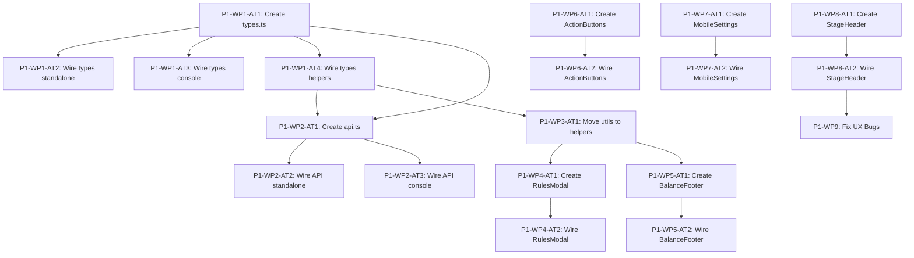

# CasinoKing — Mines Execution Plan

**Date:** 2026-03-30 | **Source:** [CTO Analysis](CTO_MINES_ANALYSIS_2026_03_30.md) | **Rules:** [AGENTS.md](../AGENTS.md), [Guardrails](TASK_EXECUTION_GUARDRAILS.md), [Source of Truth](SOURCE_OF_TRUTH.md)

---

## Level 1: Strategic Overview

| Phase | Goal | Dependencies | Success Criteria |
|-------|------|-------------|-----------------|
| **P1 — Frontend Stabilization** | Decompose `mines-standalone.tsx`, extract shared infra, fix UX bugs | None | 6 components extracted, shared types/API, UX bugs fixed, all tests pass |
| **P2 — Backend Boundary Hardening** | Complete platform-game boundary in `service.py` via `round_gateway.py` | P1 started | No direct platform-field writes in game service, all backend tests pass |
| **P3 — Frontend Product Separation** | Remove Mines code from `casinoking-console.tsx`, standalone `/mines` route | P1 done | Zero Mines logic in console, no `display:none !important` CSS hacks |
| **P4 — Schema Split & Contract** | Split `game_sessions` into platform + game tables, formalize API contract | P2 done | Two tables, migration script, gateway updated, all tests pass |

---

## PHASE 1 — Frontend Stabilization (9 WPs, 24 ATs)

### P1-WP1: Extract Shared Types Module (4 ATs)

**Goal:** Single source of truth for TypeScript types shared between `casinoking-console.tsx` and `mines-standalone.tsx`.
**Deps:** None | **Complexity:** S | **Risk:** Type variations between files — use superset with optional fields.

**P1-WP1-AT1 — Create `frontend/app/lib/types.ts`**
- **Read:** [`mines-standalone.tsx:32-131`](../frontend/app/ui/mines-standalone.tsx:32), [`casinoking-console.tsx:45-200`](../frontend/app/ui/casinoking-console.tsx:45), [`helpers.ts:14-29`](../frontend/app/lib/helpers.ts:14)
- **Create:** `frontend/app/lib/types.ts`
- **Do:** Extract shared types: `StatusKind`, `StatusMessage`, `Wallet` (superset with optional `currency_code?`, `status?`, `ledger_account_code?`), `MinesPresentationConfig`, `MinesRuntimeConfig` (merged), `FairnessCurrentConfig` (merged with optional extra fields), `SessionSnapshot`, `SessionFairness`, `ApiErrorShape`, `ApiEnvelope`, `MinesRuntimeLike`
- **Do NOT:** Modify existing files. Move file-local types like `DemoAuthResponse`, `PlayerView`, etc.
- **Verify:** `cd frontend && npx tsc --noEmit`
- **Deps:** None

**P1-WP1-AT2 — Wire types into `mines-standalone.tsx`**
- **Modify:** [`mines-standalone.tsx`](../frontend/app/ui/mines-standalone.tsx)
- **Do:** Add import from `@/app/lib/types`, remove inline shared type definitions (lines ~32-134). Keep local types: `DemoAuthResponse`, `LaunchTokenResponse`, `LaunchTokenValidationResponse`, `StartSessionResponse`.
- **Do NOT:** Change runtime behavior. Touch `ApiRequestError` class.
- **Verify:** `cd frontend && npx tsc --noEmit && npm run build`
- **Deps:** AT1

**P1-WP1-AT3 — Wire types into `casinoking-console.tsx`**
- **Modify:** [`casinoking-console.tsx`](../frontend/app/ui/casinoking-console.tsx)
- **Do:** Add import from `@/app/lib/types`, remove inline shared type definitions. Keep local types: `PlayerView`, `AdminSection`, `MinesBackofficeState`, `SessionHistoryItem`, `AccountOverview`, etc.
- **Do NOT:** Change runtime behavior.
- **Verify:** `cd frontend && npx tsc --noEmit && npm run build`
- **Deps:** AT1

**P1-WP1-AT4 — Wire types into `helpers.ts`**
- **Modify:** [`helpers.ts`](../frontend/app/lib/helpers.ts)
- **Do:** Import `MinesRuntimeLike` from `@/app/lib/types`, remove inline definition (lines 14-29).
- **Do NOT:** Change function signatures.
- **Verify:** `cd frontend && npx tsc --noEmit && npm run build`
- **Deps:** AT1

---

### P1-WP2: Extract Shared API Client (3 ATs)

**Goal:** Single `apiRequest()` and `ApiRequestError` used by both files.
**Deps:** P1-WP1 | **Complexity:** S | **Risk:** Nearly identical implementations — use the `mines-standalone.tsx` version which handles validation errors.

**P1-WP2-AT1 — Create `frontend/app/lib/api.ts`**
- **Read:** [`mines-standalone.tsx:136-146`](../frontend/app/ui/mines-standalone.tsx:136) (class), [`mines-standalone.tsx:1062-1112`](../frontend/app/ui/mines-standalone.tsx:1062) (functions)
- **Create:** `frontend/app/lib/api.ts`
- **Do:** Export `API_BASE_URL`, `ApiRequestError` class, `apiRequest<T>()`, `readErrorMessage()`. Import `ApiEnvelope` from types, `extractValidationMessage` from helpers.
- **Do NOT:** Modify existing files. Add retry logic or new features.
- **Verify:** `cd frontend && npx tsc --noEmit`
- **Deps:** P1-WP1-AT1, P1-WP1-AT4

**P1-WP2-AT2 — Wire API client into `mines-standalone.tsx`**
- **Modify:** [`mines-standalone.tsx`](../frontend/app/ui/mines-standalone.tsx)
- **Do:** Import from `@/app/lib/api`. Remove `API_BASE_URL` (line 17), `ApiRequestError` (lines 136-146), `apiRequest()` (lines 1062-1102), `readErrorMessage()` (lines 1104-1112).
- **Do NOT:** Change API call signatures.
- **Verify:** `cd frontend && npx tsc --noEmit && npm run build`
- **Deps:** AT1

**P1-WP2-AT3 — Wire API client into `casinoking-console.tsx`**
- **Modify:** [`casinoking-console.tsx`](../frontend/app/ui/casinoking-console.tsx)
- **Do:** Import from `@/app/lib/api`. Remove inline `API_BASE_URL`, `ApiRequestError`, `apiRequest()`, and any local `readErrorMessage()`.
- **Do NOT:** Change API call behavior.
- **Verify:** `cd frontend && npx tsc --noEmit && npm run build`
- **Deps:** AT1

---

### P1-WP3: Move Formatting Utilities to Shared Helpers (1 AT)

**Goal:** Move utility functions from `mines-standalone.tsx` module scope to `helpers.ts`.
**Deps:** P1-WP1 | **Complexity:** S | **Risk:** None — pure function moves.

**P1-WP3-AT1 — Move utilities to helpers**
- **Read:** [`mines-standalone.tsx:1114-1148`](../frontend/app/ui/mines-standalone.tsx:1114)
- **Modify:** [`helpers.ts`](../frontend/app/lib/helpers.ts), [`mines-standalone.tsx`](../frontend/app/ui/mines-standalone.tsx)
- **Do:** Add to helpers and export: `normalizeWholeChipInput()`, `formatWholeChipDisplay()`, `formatGridChoiceLabel()`, `isExpiredIsoDate()`, `sessionStatusKind()`. In `mines-standalone.tsx`, add to import, remove inline definitions.
- **Do NOT:** Change function signatures or behavior.
- **Verify:** `cd frontend && npx tsc --noEmit && npm run build`
- **Deps:** P1-WP1-AT4

---

### P1-WP4: Extract MinesRulesModal (2 ATs)

**Goal:** Extract rules modal from `mines-standalone.tsx`.
**Deps:** P1-WP3 | **Complexity:** S | **Risk:** Uses `dangerouslySetInnerHTML` — preserve intentionally.

**P1-WP4-AT1 — Create `frontend/app/ui/mines-rules-modal.tsx`**
- **Read:** [`mines-standalone.tsx:925-971`](../frontend/app/ui/mines-standalone.tsx:925)
- **Create:** `frontend/app/ui/mines-rules-modal.tsx`
- **Do:** Props: `rulesSections: Record<string, string>`, `payoutLadder: string[]`, `selectedGridSize: number`, `selectedMineCount: number`, `onClose: () => void`. Move the `
` block. Replace `setShowRules(false)` with `onClose()`.
- **Do NOT:** Change CSS class names. Change `dangerouslySetInnerHTML`. Add features.
- **Verify:** `cd frontend && npx tsc --noEmit`
- **Deps:** None (file creation independent)

**P1-WP4-AT2 — Wire into `mines-standalone.tsx`**
- **Modify:** [`mines-standalone.tsx`](../frontend/app/ui/mines-standalone.tsx)
- **Do:** Import `MinesRulesModal`. Replace `{showRules ? ...}` block (lines 925-971) with component.
- **Verify:** `cd frontend && npm run build`. Manual: `/mines` > click "i" > verify modal.
- **Deps:** AT1

---

### P1-WP5: Extract MinesBalanceFooter (2 ATs)

**Goal:** Extract balance footer.
**Deps:** P1-WP3 | **Complexity:** S

**P1-WP5-AT1 — Create `frontend/app/ui/mines-balance-footer.tsx`**
- **Read:** [`mines-standalone.tsx:806-821`](../frontend/app/ui/mines-standalone.tsx:806)
- **Create:** `frontend/app/ui/mines-balance-footer.tsx`
- **Do:** Import `formatWholeChipDisplay` from helpers. Props: `isDemoPlayer: boolean`, `visibleBalance: string`, `potentialPayout: string | null`. Move the `
` block.
- **Verify:** `cd frontend && npx tsc --noEmit`
- **Deps:** P1-WP3-AT1

**P1-WP5-AT2 — Wire into `mines-standalone.tsx`**
- **Modify:** [`mines-standalone.tsx`](../frontend/app/ui/mines-standalone.tsx)
- **Do:** Import `MinesBalanceFooter`. Replace `balanceFooter` const (lines 806-821) with component.
- **Verify:** `cd frontend && npm run build`. Manual: verify balance on desktop and mobile.
- **Deps:** AT1

---

### P1-WP6: Extract MinesActionButtons (2 ATs)

**Goal:** Extract Bet/Collect buttons.
**Deps:** P1-WP1 | **Complexity:** S | **Risk:** Bet button is `type="submit"` — must preserve.

**P1-WP6-AT1 — Create `frontend/app/ui/mines-action-buttons.tsx`**
- **Read:** [`mines-standalone.tsx:781-804`](../frontend/app/ui/mines-standalone.tsx:781)
- **Create:** `frontend/app/ui/mines-action-buttons.tsx`
- **Do:** Props: `useMobileLayout`, `betButtonLabel`, `collectButtonLabel`, `isBetDisabled`, `isCollectDisabled`, `onCashout`. Bet = `type="submit"`, Collect = `type="button"`.
- **Verify:** `cd frontend && npx tsc --noEmit`
- **Deps:** None

**P1-WP6-AT2 — Wire into `mines-standalone.tsx`**
- **Modify:** [`mines-standalone.tsx`](../frontend/app/ui/mines-standalone.tsx)
- **Do:** Import `MinesActionButtons`. Replace `actionButtons` const (lines 781-804) with component.
- **Verify:** `cd frontend && npm run build`. Manual: Bet and Collect work.
- **Deps:** AT1

---

### P1-WP7: Extract MinesMobileSettingsSheet (2 ATs)

**Goal:** Extract mobile settings bottom sheet.
**Deps:** P1-WP1 | **Complexity:** S

**P1-WP7-AT1 — Create `frontend/app/ui/mines-mobile-settings-sheet.tsx`**
- **Read:** [`mines-standalone.tsx:973-1002`](../frontend/app/ui/mines-standalone.tsx:973)
- **Create:** `frontend/app/ui/mines-mobile-settings-sheet.tsx`
- **Do:** Props: `isDemoPlayer: boolean`, `onClose: () => void`, `children: ReactNode`. Move the overlay block. Replace `{configFields}` with `{children}`.
- **Verify:** `cd frontend && npx tsc --noEmit`
- **Deps:** None

**P1-WP7-AT2 — Wire into `mines-standalone.tsx`**
- **Modify:** [`mines-standalone.tsx`](../frontend/app/ui/mines-standalone.tsx)
- **Do:** Import `MinesMobileSettingsSheet`. Replace `{useMobileLayout && showMobileSettings ? ...}` block (lines 973-1002) with component, passing `configFields` as children.
- **Verify:** `cd frontend && npm run build`. Manual: mobile settings sheet opens/closes.
- **Deps:** AT1

---

### P1-WP8: Extract MinesStageHeader (2 ATs)

**Goal:** Extract stage header (MINES wordmark, subtitle, payout preview, close button).
**Deps:** P1-WP3 | **Complexity:** M | **Risk:** Used in both desktop and mobile layouts. Must accept `mobileStageTools` as prop.

**P1-WP8-AT1 — Create `frontend/app/ui/mines-stage-header.tsx`**
- **Read:** [`mines-standalone.tsx:823-863`](../frontend/app/ui/mines-standalone.tsx:823), [`mines-standalone.tsx:686-697`](../frontend/app/ui/mines-standalone.tsx:686)
- **Create:** `frontend/app/ui/mines-stage-header.tsx`
- **Do:** Import `ReactNode`. Props: `stageSubtitle: string | null`, `stageSubtitleTone: "won" | "lost" | null`, `previewMultipliers: string[]`, `previewWindowStart: number`, `visibleGridSize: number`, `selectedMineCount: number`, `isEmbeddedView: boolean`, `isHostFullscreen: boolean`, `useMobileLayout: boolean`, `mobileStageTools: ReactNode`, `onExit: () => void`. Move the `<article className="mines-stage-card">` block.
- **Verify:** `cd frontend && npx tsc --noEmit`
- **Deps:** None

**P1-WP8-AT2 — Wire into `mines-standalone.tsx`**
- **Modify:** [`mines-standalone.tsx`](../frontend/app/ui/mines-standalone.tsx)
- **Do:** Import `MinesStageHeader`. Replace `stageHeader` const (lines 823-863) with component. Pass `mobileStageTools` JSX as prop.
- **Verify:** `cd frontend && npm run build`. Manual: verify wordmark, subtitle, payout chips, close button.
- **Deps:** AT1

---

### P1-WP9: Fix UX Layout Bugs (6 ATs)

**Goal:** Fix U1 (win message layout shift), U2 (multiplier badge overflow), U3 (bet amount label overlap).
**Deps:** P1-WP8 | **Complexity:** M | **Risk:** CSS changes can cascade. Each fix must be isolated and verified independently.

**P1-WP9-AT1 — Fix U1: Win message layout shift (CSS)**
- **Read:** [`globals.css:2339-2341`](../frontend/app/globals.css:2339) (mobile subtitle hide), [`globals.css:2423-2428`](../frontend/app/globals.css:2423) (mobile subtitle show)
- **Modify:** [`globals.css`](../frontend/app/globals.css)
- **Do:** Add a fixed-height notification slot for the stage subtitle. The `.mines-stage-subtitle` should have `min-height: 1.5em` (or equivalent) so the MINES wordmark and payout preview chips do not shift when the subtitle appears/disappears. On desktop, add `min-height: 24px` to `.mines-stage-subtitle`. On mobile layout, add `min-height: 20px` to `.mines-mobile-layout .mines-stage-subtitle`.
- **Do NOT:** Change the subtitle content or logic. Add new HTML elements.
- **Verify:** `cd frontend && npm run build`. Manual: start a round, win/lose, verify no layout shift in the header area.
- **Deps:** P1-WP8-AT2

**P1-WP9-AT2 — Fix U1: Win message layout shift (component)**
- **Read:** [`mines-stage-header.tsx`](../frontend/app/ui/mines-stage-header.tsx) (after P1-WP8)
- **Modify:** [`mines-stage-header.tsx`](../frontend/app/ui/mines-stage-header.tsx)
- **Do:** Ensure the subtitle `
` element is always rendered (not conditionally). When `stageSubtitle` is null, render `
&nbsp;
` or use `visibility: hidden` via a CSS class. This prevents the container from collapsing.
- **Do NOT:** Change the subtitle text content. Add new UI elements.
- **Verify:** Manual: verify no layout jump on win/loss transition.
- **Deps:** AT1, P1-WP8-AT2

**P1-WP9-AT3 — Fix U2: Multiplier badge overflow**
- **Read:** [`globals.css`](../frontend/app/globals.css) — search for `.mines-payout-preview` and `.mines-preview-chip`
- **Modify:** [`globals.css`](../frontend/app/globals.css)
- **Do:** Add `overflow: hidden` and `text-overflow: ellipsis` to `.mines-preview-chip`. Add `max-width` constraint to `.mines-payout-preview` on desktop. On mobile, the grid layout (lines 2438-2443) already constrains width — verify it works. For desktop, add `flex-wrap: nowrap` and `overflow: hidden` to `.mines-payout-preview`.
- **Do NOT:** Change the number of preview chips shown. Change the multiplier format.
- **Verify:** Manual: select a configuration with long multiplier values (e.g., 0.9531x), verify no overflow on narrow viewports.
- **Deps:** None

**P1-WP9-AT4 — Fix U3: Bet amount label overlap**
- **Read:** [`mines-standalone.tsx:756-779`](../frontend/app/ui/mines-standalone.tsx:756), [`globals.css`](../frontend/app/globals.css) — search for `.mines-control-rail .field`
- **Modify:** [`globals.css`](../frontend/app/globals.css)
- **Do:** On mobile, the bet amount field label and input can overlap with the balance footer. Add `gap: 4px` between label and input in `.mines-mobile-bet-panel .field`. Ensure the label does not wrap over the input by adding `white-space: nowrap` to `.mines-mobile-bet-panel .field label`.
- **Do NOT:** Change the bet field structure. Remove the label.
- **Verify:** Manual: on mobile viewport, verify bet amount label and input are clearly separated.
- **Deps:** None

**P1-WP9-AT5 — Fix U4: Remove confusing mobile subtitle CSS override chain**
- **Read:** [`globals.css:2339-2341`](../frontend/app/globals.css:2339), [`globals.css:2423-2428`](../frontend/app/globals.css:2423)
- **Modify:** [`globals.css`](../frontend/app/globals.css)
- **Do:** The mobile layout hides `.mines-stage-subtitle` at line 2339 then shows it again at line 2423. Remove the hide rule at line 2339-2341 (`.mines-product-shell.mines-product-shell-mobile .mines-stage-subtitle { display: none; }`). The mobile layout JSX uses `.mines-mobile-layout .mines-stage-subtitle` which has its own display rule. This eliminates the confusing override chain.
- **Do NOT:** Change the mobile layout JSX. Add new CSS rules.
- **Verify:** Manual: on mobile, verify subtitle appears correctly after win/loss.
- **Deps:** P1-WP9-AT1

**P1-WP9-AT6 — Verify all UX fixes together**
- **Do:** Run `cd frontend && npm run build`. Open `/mines` in browser. Test the following scenarios on both desktop and mobile viewports:
  1. Start a round — verify no layout shift
  2. Win a round — verify "Hai vinto" message appears without pushing content down
  3. Lose a round — verify "Hai perso" message appears without layout shift
  4. Check multiplier preview chips with various mine counts — verify no overflow
  5. Check bet amount field on mobile — verify no label overlap
- **Deps:** AT1-AT5

---

## PHASE 2 — Backend Boundary Hardening (3 WPs, 9 ATs)

### P2-WP1: Refactor `service.py` INSERT to Receive Platform Fields (3 ATs)

**Goal:** The `game_sessions` INSERT in [`service.py:94-151`](../backend/app/modules/games/mines/service.py:94) should receive `wallet_account_id`, `start_ledger_transaction_id`, `wallet_balance_after_start` from the gateway return value without the game service needing to know their semantics.
**Deps:** None | **Complexity:** M | **Risk:** Must not break idempotency handling.

**P2-WP1-AT1 — Extend `round_gateway.open_round()` return type**
- **Read:** [`round_gateway.py:25-51`](../backend/app/modules/games/mines/round_gateway.py:25), [`platform/rounds/service.py:42-162`](../backend/app/modules/platform/rounds/service.py:42)
- **Modify:** [`round_gateway.py`](../backend/app/modules/games/mines/round_gateway.py)
- **Do:** Document the return dict shape explicitly. Currently returns `{"wallet_account_id", "wallet_balance_after_start", "ledger_transaction_id"}`. Add a docstring or type comment. No code change needed — this is documentation.
- **Verify:** `cd backend && python -m pytest tests/ -x --timeout=30`
- **Deps:** None

**P2-WP1-AT2 — Extract game session INSERT into helper function**
- **Read:** [`service.py:94-151`](../backend/app/modules/games/mines/service.py:94)
- **Modify:** [`service.py`](../backend/app/modules/games/mines/service.py)
- **Do:** Extract the `cursor.execute(INSERT INTO game_sessions ...)` block (lines 94-151) into a private function `_insert_game_session(cursor, *, session_id, user_id, ..., platform_round_result)` that takes the `round_open_result` dict as a parameter. The function unpacks `wallet_account_id`, `ledger_transaction_id`, `wallet_balance_after_start` from the dict internally. This is a pure refactor — same SQL, same behavior.
- **Do NOT:** Change the SQL. Change the column set. Add new parameters.
- **Verify:** `cd backend && python -m pytest tests/ -x --timeout=30`
- **Deps:** AT1

**P2-WP1-AT3 — Extract game session UPDATE into helper functions**
- **Read:** [`service.py:388-404`](../backend/app/modules/games/mines/service.py:388) (loss UPDATE), [`service.py:438-458`](../backend/app/modules/games/mines/service.py:438) (auto-win UPDATE), [`service.py:471-489`](../backend/app/modules/games/mines/service.py:471) (continue UPDATE), [`service.py:571-579`](../backend/app/modules/games/mines/service.py:571) (cashout UPDATE)
- **Modify:** [`service.py`](../backend/app/modules/games/mines/service.py)
- **Do:** Extract each UPDATE into a private helper: `_close_session_as_lost()`, `_close_session_as_won()`, `_update_session_after_safe_reveal()`. These are pure refactors — same SQL.
- **Do NOT:** Change SQL. Change behavior.
- **Verify:** `cd backend && python -m pytest tests/ -x --timeout=30`
- **Deps:** None

---

### P2-WP2: Remove Direct Platform Field Knowledge from Game Service (3 ATs)

**Goal:** `service.py` should not reference `wallet_account_id`, `start_ledger_transaction_id`, `wallet_balance_after_start` as named concepts — only pass them through from the gateway.
**Deps:** P2-WP1 | **Complexity:** M | **Risk:** The `_start_response_from_existing()` function reads these fields from the DB for idempotent retries. Must ensure the response still includes them.

**P2-WP2-AT1 — Audit all platform-field references in `service.py`**
- **Read:** Full [`service.py`](../backend/app/modules/games/mines/service.py)
- **Do:** List every line that references `wallet_account_id`, `start_ledger_transaction_id`, `wallet_balance_after_start`. Document which are writes (INSERT), which are reads (SELECT for response building), and which are in the idempotency path.
- **Output:** Comment block or internal documentation in the file listing the references.
- **Verify:** No code changes — documentation only.
- **Deps:** None

**P2-WP2-AT2 — Encapsulate platform fields in INSERT helper**
- **Modify:** [`service.py`](../backend/app/modules/games/mines/service.py)
- **Do:** In `_insert_game_session()` (from P2-WP1-AT2), rename the parameter from individual fields to `platform_round_result: dict` and unpack internally. The game service passes the gateway result as an opaque dict.
- **Do NOT:** Remove the columns from the INSERT — they are still needed for the current schema.
- **Verify:** `cd backend && python -m pytest tests/ -x --timeout=30`
- **Deps:** P2-WP1-AT2

**P2-WP2-AT3 — Add gateway function for idempotent response building**
- **Read:** [`service.py:791-802`](../backend/app/modules/games/mines/service.py:791) (`_start_response_from_existing`)
- **Modify:** [`round_gateway.py`](../backend/app/modules/games/mines/round_gateway.py), [`service.py`](../backend/app/modules/games/mines/service.py)
- **Do:** Add `get_round_start_snapshot(cursor, session_id)` to `round_gateway.py` that reads `wallet_balance_after_start` and `start_ledger_transaction_id` from `game_sessions`. Use this in `_start_response_from_existing()` instead of direct field access. This moves the knowledge of which fields are "platform" into the gateway.
- **Do NOT:** Change the response shape. Break idempotency.
- **Verify:** `cd backend && python -m pytest tests/ -x --timeout=30`
- **Deps:** AT2

---

### P2-WP3: Add Backend Boundary Tests (3 ATs)

**Goal:** Ensure the boundary is tested and documented.
**Deps:** P2-WP2 | **Complexity:** S

**P2-WP3-AT1 — Add test: game service does not import platform modules directly**
- **Create:** `tests/contract/test_boundary_imports.py`
- **Do:** Write a test that inspects `service.py` imports and asserts it does NOT import from `app.modules.platform` directly — only from `app.modules.games.mines.round_gateway`.
- **Verify:** `cd backend && python -m pytest tests/contract/test_boundary_imports.py -v`
- **Deps:** P2-WP2-AT3

**P2-WP3-AT2 — Add test: round_gateway translates all exceptions**
- **Create:** `tests/contract/test_round_gateway_contract.py`
- **Do:** Write tests that verify `round_gateway` functions translate `PlatformRound*Error` exceptions into `Mines*Error` exceptions. Test `open_round`, `settle_round_win`, `settle_round_loss`.
- **Verify:** `cd backend && python -m pytest tests/contract/test_round_gateway_contract.py -v`
- **Deps:** None

**P2-WP3-AT3 — Run full test suite**
- **Do:** `cd backend && python -m pytest tests/ --timeout=30`
- **Verify:** All tests pass.
- **Deps:** AT1, AT2

---

## PHASE 3 — Frontend Product Separation (4 WPs, 10 ATs)

### P3-WP1: Move Mines Components to Dedicated Directory (2 ATs)

**Goal:** All Mines UI components live under `frontend/app/ui/mines/`.
**Deps:** P1 complete | **Complexity:** S

**P3-WP1-AT1 — Create `frontend/app/ui/mines/` directory and move files**
- **Do:** Move these files to `frontend/app/ui/mines/`:
  - `mines-standalone.tsx` → `mines/mines-standalone.tsx`
  - `mines-board.tsx` → `mines/mines-board.tsx`
  - `mines-stage-header.tsx` → `mines/mines-stage-header.tsx`
  - `mines-rules-modal.tsx` → `mines/mines-rules-modal.tsx`
  - `mines-balance-footer.tsx` → `mines/mines-balance-footer.tsx`
  - `mines-action-buttons.tsx` → `mines/mines-action-buttons.tsx`
  - `mines-mobile-settings-sheet.tsx` → `mines/mines-mobile-settings-sheet.tsx`
- Create `frontend/app/ui/mines/index.ts` barrel export.
- **Verify:** `cd frontend && npx tsc --noEmit`
- **Deps:** All P1 WPs

**P3-WP1-AT2 — Update all import paths**
- **Modify:** [`frontend/app/mines/page.tsx`](../frontend/app/mines/page.tsx), any other files importing from old paths
- **Do:** Update `import { MinesStandalone } from "../ui/mines-standalone"` to `import { MinesStandalone } from "../ui/mines/mines-standalone"` (or from barrel).
- **Verify:** `cd frontend && npm run build`
- **Deps:** AT1

---

### P3-WP2: Extract Mines Backoffice from `casinoking-console.tsx` (3 ATs)

**Goal:** Move the Mines backoffice editor (rules, config, labels, assets) out of `casinoking-console.tsx` into a dedicated module.
**Deps:** P3-WP1 | **Complexity:** L | **Risk:** The backoffice editor is deeply embedded in the admin section of the console. Must identify all Mines-specific admin code.

**P3-WP2-AT1 — Identify all Mines backoffice code in `casinoking-console.tsx`**
- **Read:** Full [`casinoking-console.tsx`](../frontend/app/ui/casinoking-console.tsx) — search for `backoffice`, `MinesBackoffice`, `AdminGamesSubsection`, `MINES_RULE_SECTION_FIELDS`, `MINES_LABEL_FIELDS`, `draft`, `published`
- **Do:** Document all line ranges containing Mines backoffice logic. Create a mapping of which JSX blocks, state variables, and handlers belong to the Mines backoffice.
- **Output:** Internal documentation comment or separate notes file.
- **Deps:** None

**P3-WP2-AT2 — Create `frontend/app/ui/mines/mines-backoffice-editor.tsx`**
- **Do:** Extract the Mines backoffice editor into a standalone component. Props should include: `accessToken`, `onStatusChange`, and any admin context needed. The component manages its own backoffice state (`MinesBackofficeState`), draft/publish workflow, and API calls.
- **Do NOT:** Change the backoffice functionality. Add new features.
- **Verify:** `cd frontend && npx tsc --noEmit`
- **Deps:** AT1

**P3-WP2-AT3 — Wire backoffice editor into `casinoking-console.tsx`**
- **Modify:** [`casinoking-console.tsx`](../frontend/app/ui/casinoking-console.tsx)
- **Do:** Replace the inline Mines backoffice code with `<MinesBackofficeEditor />` component. Remove all Mines-specific admin state, handlers, and JSX from the console.
- **Verify:** `cd frontend && npm run build`. Manual: admin > games section works.
- **Deps:** AT2

---

### P3-WP3: Remove Mines Game Code from `casinoking-console.tsx` (3 ATs)

**Goal:** Remove all Mines player-facing game code from the console. The console should only contain platform UI.
**Deps:** P3-WP2 | **Complexity:** M

**P3-WP3-AT1 — Identify all Mines player game code in console**
- **Read:** [`casinoking-console.tsx`](../frontend/app/ui/casinoking-console.tsx) — search for `mines`, `MinesBoard`, `session`, `reveal`, `cashout`
- **Do:** Document all Mines player-facing code: the embedded iframe/launch flow, any legacy Mines views, session state management.
- **Deps:** None

**P3-WP3-AT2 — Remove Mines player code from console**
- **Modify:** [`casinoking-console.tsx`](../frontend/app/ui/casinoking-console.tsx)
- **Do:** Remove all Mines player-facing code. The lobby should link to `/mines` route instead of rendering Mines inline. Remove the `MinesBoard` import. Remove Mines-specific state variables.
- **Do NOT:** Remove the lobby card/link that launches Mines. Remove admin functionality.
- **Verify:** `cd frontend && npm run build`. Manual: lobby shows Mines card, clicking it navigates to `/mines`.
- **Deps:** AT1

**P3-WP3-AT3 — Verify `/mines` route independence**
- **Do:** Verify that [`frontend/app/mines/page.tsx`](../frontend/app/mines/page.tsx) works without any import from `casinoking-console.tsx`. The only shared dependencies should be `@/app/lib/types`, `@/app/lib/api`, and `helpers.ts`.
- **Verify:** `cd frontend && npm run build`. Manual: navigate directly to `/mines`, verify full game flow works.
- **Deps:** AT2

---

### P3-WP4: Clean Up CSS Overrides (2 ATs)

**Goal:** Remove `display: none !important` CSS blocks that were hiding legacy elements.
**Deps:** P3-WP3 | **Complexity:** S

**P3-WP4-AT1 — Remove legacy CSS hide rules**
- **Read:** [`globals.css:2075-2119`](../frontend/app/globals.css:2075)
- **Modify:** [`globals.css`](../frontend/app/globals.css)
- **Do:** Remove or reduce the `display: none` and `display: none !important` blocks (lines 2075-2119) that were hiding legacy Mines elements from the clean product shell. After P3-WP3, these elements should no longer exist in the DOM.
- **Do NOT:** Remove CSS rules that are still needed for active components.
- **Verify:** `cd frontend && npm run build`. Manual: verify no hidden elements reappear.
- **Deps:** P3-WP3-AT2

**P3-WP4-AT2 — Audit remaining CSS for dead selectors**
- **Do:** Search `globals.css` for selectors that reference classes no longer present in any TSX file. Document them. Remove confirmed dead selectors.
- **Verify:** `cd frontend && npm run build`. Manual: spot-check all views.
- **Deps:** AT1

---

## PHASE 4 — Schema Split & Contract Formalization (3 WPs, 8 ATs)

### P4-WP1: Design Split Schema (2 ATs)

**Goal:** Design the `platform_rounds` and `mines_game_rounds` tables.
**Deps:** P2 complete | **Complexity:** M | **Risk:** Must maintain backward compatibility during migration.

**P4-WP1-AT1 — Design `platform_rounds` table**
- **Read:** [`0005__game_sessions_foundations.sql`](../backend/migrations/sql/0005__game_sessions_foundations.sql), [`0009__game_sessions_runtime_hardening.sql`](../backend/migrations/sql/0009__game_sessions_runtime_hardening.sql), [Documento 12 v3](md/CasinoKing_Documento_12_v3_Schema_Database_Definitivo.md), [Documento 31](md/CasinoKing_Documento_31_Contratto_Tra_Platform_Backend_E_Mines_Backend.md)
- **Do:** Design `platform_rounds` table with columns: `id`, `user_id`, `game_code`, `wallet_account_id`, `wallet_type`, `bet_amount`, `status`, `start_ledger_transaction_id`, `settlement_ledger_transaction_id`, `wallet_balance_after_start`, `payout_amount`, `idempotency_key`, `request_fingerprint`, `created_at`, `closed_at`. Document the design.
- **Output:** Design document or SQL draft.
- **Deps:** None

**P4-WP1-AT2 — Design `mines_game_rounds` table**
- **Do:** Design `mines_game_rounds` table with columns: `id`, `platform_round_id` (FK to `platform_rounds`), `user_id`, `grid_size`, `mine_count`, `safe_reveals_count`, `revealed_cells_json`, `mine_positions_json`, `multiplier_current`, `payout_current`, `fairness_version`, `nonce`, `server_seed_hash`, `rng_material`, `board_hash`, `created_at`, `closed_at`. Document the design.
- **Output:** Design document or SQL draft.
- **Deps:** AT1

---

### P4-WP2: Create Migration (3 ATs)

**Goal:** Write SQL migration to create new tables and migrate data.
**Deps:** P4-WP1 | **Complexity:** L | **Risk:** Data migration on production. Must be reversible.

**P4-WP2-AT1 — Write migration SQL: create new tables**
- **Create:** `backend/migrations/sql/0012__schema_split_platform_rounds.sql`
- **Do:** CREATE TABLE `platform_rounds` and `mines_game_rounds` with proper constraints, indexes, and foreign keys. Do NOT drop `game_sessions` yet.
- **Verify:** Apply migration against test database.
- **Deps:** P4-WP1

**P4-WP2-AT2 — Write data migration SQL**
- **Create:** `backend/migrations/sql/0013__migrate_game_sessions_data.sql`
- **Do:** INSERT INTO `platform_rounds` SELECT platform fields FROM `game_sessions`. INSERT INTO `mines_game_rounds` SELECT game fields FROM `game_sessions`. Add `platform_round_id` mapping.
- **Verify:** Apply migration, verify row counts match.
- **Deps:** AT1

**P4-WP2-AT3 — Write migration SQL: add backward-compat view**
- **Create:** Part of migration `0013`
- **Do:** Create a VIEW `game_sessions_compat` that JOINs `platform_rounds` and `mines_game_rounds` to provide the same column set as the original `game_sessions`. This allows gradual code migration.
- **Verify:** Query the view, verify it returns same data as original table.
- **Deps:** AT2

---

### P4-WP3: Update Backend Code for Split Schema (3 ATs)

**Goal:** Update `service.py`, `round_gateway.py`, and `platform/rounds/service.py` to use the new tables.
**Deps:** P4-WP2 | **Complexity:** L | **Risk:** Must update all SQL queries. Use the compat view as fallback.

**P4-WP3-AT1 — Update `platform/rounds/service.py` to use `platform_rounds`**
- **Modify:** [`platform/rounds/service.py`](../backend/app/modules/platform/rounds/service.py)
- **Do:** Change all `game_sessions` references to `platform_rounds` for financial operations. The `open_mines_round()` function should INSERT into `platform_rounds` instead of relying on the game service to INSERT into `game_sessions`.
- **Verify:** `cd backend && python -m pytest tests/ -x --timeout=30`
- **Deps:** P4-WP2-AT1

**P4-WP3-AT2 — Update `service.py` to use `mines_game_rounds`**
- **Modify:** [`service.py`](../backend/app/modules/games/mines/service.py)
- **Do:** Change the INSERT to write to `mines_game_rounds` instead of `game_sessions`. Change all SELECT/UPDATE queries to use `mines_game_rounds`. The `platform_round_id` comes from the gateway.
- **Verify:** `cd backend && python -m pytest tests/ -x --timeout=30`
- **Deps:** AT1

**P4-WP3-AT3 — Update `round_gateway.py` to bridge both tables**
- **Modify:** [`round_gateway.py`](../backend/app/modules/games/mines/round_gateway.py)
- **Do:** Update `get_cashout_snapshot()` to JOIN `platform_rounds` and `mines_game_rounds`. Update any other cross-table queries.
- **Verify:** `cd backend && python -m pytest tests/ --timeout=30` — ALL tests must pass.
- **Deps:** AT1, AT2

---

## Summary

### Totals

| Phase | WPs | ATs |
|-------|-----|-----|
| P1 — Frontend Stabilization | 9 | 24 |
| P2 — Backend Boundary Hardening | 3 | 9 |
| P3 — Frontend Product Separation | 4 | 10 |
| P4 — Schema Split & Contract | 3 | 8 |
| **Total** | **19** | **51** |

### First 5 ATs to Execute (Immediate Next Steps)

1. **P1-WP1-AT1** — Create `frontend/app/lib/types.ts` with shared type definitions
2. **P1-WP1-AT2** — Wire shared types into `mines-standalone.tsx`
3. **P1-WP1-AT3** — Wire shared types into `casinoking-console.tsx`
4. **P1-WP1-AT4** — Wire shared types into `helpers.ts`
5. **P1-WP2-AT1** — Create `frontend/app/lib/api.ts` with shared API client

### Dependency Graph (Phase 1)

### Ambiguities and Decisions Needed

1. **Helper file naming:** `helpers.ts` is the neutral shared utility file used by both platform and game.

2. **CSS file strategy:** `globals.css` at 3,732 lines is a single file for all styles. Should Mines-specific CSS be extracted to a separate file? **Recommendation:** Defer to after Phase 3. The current single-file approach works with Next.js global CSS. Extraction would require CSS modules or a different strategy.

3. **`MinesRuntimeLike` vs `MinesRuntimeConfig`:** The helpers use a structural subset type. After shared types are in place, should we use `MinesRuntimeConfig` directly? **Recommendation:** Keep `MinesRuntimeLike` as a narrower interface — it documents the minimum contract the helpers need.

4. **Backoffice editor extraction scope (P3-WP2):** The Mines backoffice editor in `casinoking-console.tsx` is deeply interleaved with admin state management. The exact line ranges need to be identified during P3-WP2-AT1. This AT is intentionally an audit step before extraction.

5. **Schema split timing (P4):** The `game_sessions` table split is the most invasive change. It should only proceed after P2 is fully tested and stable. The backward-compat view (P4-WP2-AT3) provides a safety net.
