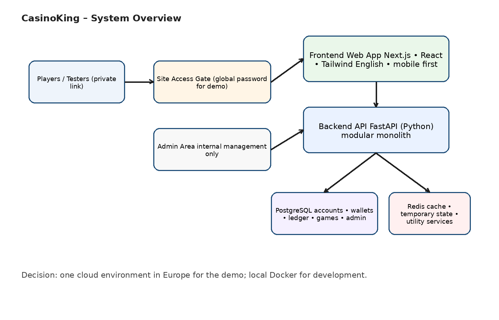
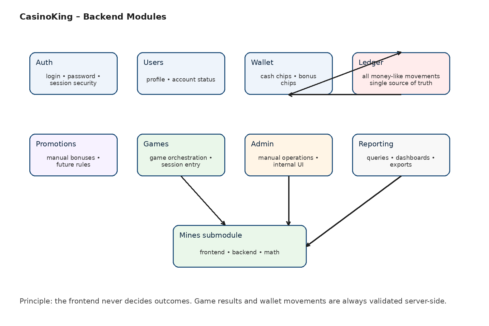
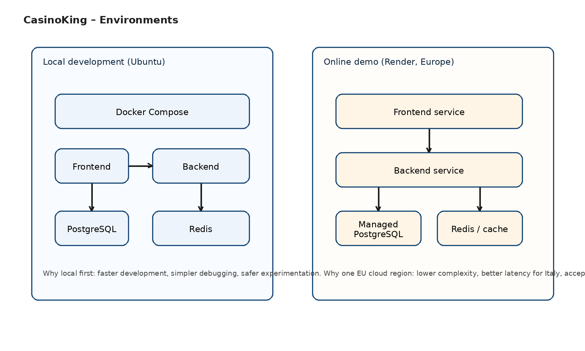
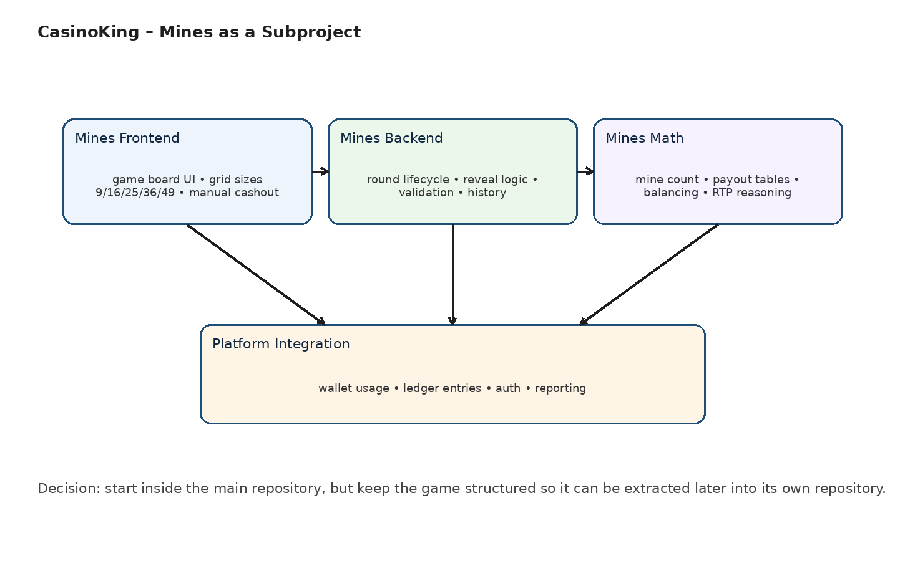

# CasinoKing

Documento 02 – Fondazioni, decisioni e architettura high level

Versione condivisibile con sviluppatori
Base teorica iniziale del progetto

| Data | 22 marzo 2026 |
| --- | --- |
| Lingua front end | English |
| Modalità progetto | Demo reale, privata, cloud-ready |
| Stato | Fondazioni definite; sviluppo non iniziato |

Scopo del documento

Raccogliere in forma ordinata le conclusioni emerse finora: visione del progetto, perimetro MVP, scelte tecnologiche, decisioni architetturali, costi iniziali stimati, struttura modulare, criteri di scalabilità e prime rappresentazioni grafiche.

## 1. Executive summary

CasinoKing nasce come progetto amatoriale ma ambizioso: una piattaforma online casino con demo reale funzionante, non un semplice mockup. La prima versione dovrà sembrare un prodotto vero, pur restando limitata a chip finte, accesso privato e un solo gioco iniziale.

| Decisioni già prese |
| --- |
| Tipo di prodotto iniziale: casino only |
| Modalità demo: privata, accessibile con password globale |
| Primo gioco: Mines |
| Wallet iniziale: Cash Chips + Bonus Chips, saldi separati |
| Credito iniziale al signup: 1000 chip |
| Back office MVP: manuale, usato solo dal fondatore |
| Cloud iniziale: sì, ma con configurazione semplice e regione europea |

## 2. Fatti, ipotesi e punti ancora aperti

### Fatti

- La demo deve essere online e utilizzabile da chi possiede il link e la password di accesso.
- Il front end sarà mobile first e in lingua inglese.
- L'utente potrà registrarsi con email e password.
- Il sistema dovrà prevedere due wallet distinti: Cash Chips e Bonus Chips.
- Le promozioni iniziali saranno manuali, gestite dal back office.
- Il primo gioco da realizzare sarà Mines, con scelta del numero di mine e della dimensione della griglia (9, 16, 25, 36, 49).

### Ipotesi di lavoro

- Il gioco Mines sarà un sottoprogetto con componenti proprie: frontend, backend e matematica.
- L'architettura dovrà essere progettata per futura estrazione di giochi in moduli o repository dedicati.
- Nel tempo potranno arrivare altri giochi, integrazione in CMS WordPress e potenziale distribuzione su piattaforme esterne.

### Punti aperti

- Email verification: da decidere in seguito.
- Strategia di integrazione futura dei giochi: iframe, SDK JavaScript, API o modello ibrido.
- Evoluzione ruoli back office: per ora solo admin fondatore, in futuro ruoli differenziati.

## 3. Visione prodotto e perimetro MVP

### Visione

L'obiettivo è costruire una piattaforma proprietaria con backend robusto, giochi proprietari, ledger affidabile, wallet separati, motore promozioni e interfaccia amministrativa. La demo deve essere coerente con un prodotto reale e fungere da base teorica e tecnica per evoluzioni successive.

### Scope incluso nel primo MVP

- Accesso con password globale al sito.
- Registrazione, login, logout e reset password base.
- Accredito automatico di 1000 chip al nuovo account.
- Due saldi separati: Cash Chips e Bonus Chips.
- Una lobby semplice con un gioco iniziale: Mines.
- Storico di gioco e storico movimenti wallet.
- Back office base per vedere utenti, modificare saldi, assegnare bonus, attivare/disattivare account.
- Reporting base per giocate e transazioni.

### Esplicitamente escluso dal primo MVP

- Soldi veri e crypto reali.
- KYC, AML, compliance multi-country, certificazioni di gambling.
- Provider esterni di giochi.
- Sportsbook.
- WordPress nel core della piattaforma.
- Più giochi contemporaneamente.

## 4. Registro decisioni

| Area | Decisione | Motivazione | Impatto |
| --- | --- | --- | --- |
| Architettura | Modular monolith | Riduce complessità iniziale ma mantiene confini chiari tra moduli. | Permette velocità di sviluppo e futura estrazione di componenti. |
| Cloud | Deploy iniziale su provider semplice | Serve una demo vera online senza partire da infrastruttura enterprise. | Costi e operations contenuti. |
| Database | PostgreSQL | Più adatto di un document DB per wallet, ledger, reporting e integrità transazionale. | Base solida e open source. |
| Caching/supporto | Redis | Utile per cache, stato temporaneo e servizi di appoggio. | Aumenta flessibilità senza complicare troppo. |
| Front end | Next.js + React + Tailwind | Scelta web moderna, mobile first, adatta a UI modulari. | Buon equilibrio tra produttività e qualità. |
| Back end | FastAPI (Python) | Python è accettato; FastAPI è adatto ad API moderne e chiare. | Ottima base per backend strutturato. |
| Sviluppo locale | Ubuntu + Docker locale | Ambiente più vicino al cloud e più lineare di Windows per questo tipo di stack. | Riduce attriti tecnici. |
| NAS | Non usato per sviluppo iniziale | Meglio evitare dipendenze di rete e complessità extra nelle prime fasi. | NAS potrà servire più avanti per test o ambienti sempre attivi. |
| Gioco Mines | Dentro repo principale all'inizio, ma separabile | Massima semplicità ora, separazione concettuale futura. | Facilita riuso ed estrazione successiva. |
| Firebase | Scartato come core | Meno adatto a ledger rigoroso, contabilità interna e reporting relazionale. | Riduce rischio di lock-in e modello dati non ideale. |

## 5. Scelte tecnologiche

### Stack iniziale raccomandato

- Frontend: Next.js + React + Tailwind
- Backend: Python + FastAPI
- Database: PostgreSQL
- Servizi di supporto: Redis
- Containerizzazione: Docker
- Versionamento: GitHub

### Nota terminologica

SQL non è il database: SQL è il linguaggio. Il database consigliato è PostgreSQL.

### Perché non Firebase come base del progetto

- Il progetto richiede movimenti di wallet, ledger, reporting e integrità transazionale forti.
- Un database relazionale è più naturale per contabilità interna, storico e audit.
- Si vuole mantenere controllo applicativo su auth, logica e struttura dati.

## 6. Diagrammi architetturali

### 6.1 Vista di insieme del sistema

Figura 1. Vista di insieme: access gate, front end, backend e storage.

Interpretazione semplificata: l'utente entra tramite link privato e password globale; il frontend presenta lobby e gioco; il backend governa logica, sicurezza e integrazioni; PostgreSQL conserva i dati persistenti; Redis supporta componenti temporanei e cache.

### 6.2 Moduli del backend

Figura 2. Moduli applicativi del backend.

La scelta architetturale non è quella dei microservizi subito. Il backend sarà unico ma diviso in moduli con responsabilità nette. Questo consente di partire in modo semplice senza perdere la possibilità di estrarre parti in futuro.

### 6.3 Ambienti

Figura 3. Ambienti iniziali: sviluppo locale e demo online.

Sviluppo in locale con Docker su Ubuntu; demo online in un'unica regione europea. Per un gioco come Mines, la latenza internazionale non è un blocco per il MVP.

### 6.4 Mines come sottoprogetto

Figura 4. Scomposizione del gioco Mines.

Mines viene pensato come prodotto separabile: una UI dedicata, una logica server-side dedicata e un nucleo matematico dedicato, integrati con wallet, ledger, auth e reporting della piattaforma.

## 7. Approccio architetturale: spiegazione a doppio livello

### Livello 1 – Spiegazione semplice

- All'inizio non conviene partire con veri microservizi: aggiungono troppa complessità.
- Conviene invece costruire un backend unico ma ordinato, con blocchi interni chiari.
- Ogni blocco avrà un confine preciso: utenti, wallet, ledger, promo, giochi, reporting, admin.
- Quando il progetto crescerà, alcuni blocchi potranno essere estratti e separati.

### Livello 2 – Spiegazione tecnica per sviluppatori

- Pattern iniziale: modular monolith con boundary applicativi espliciti.
- L'interfaccia tra moduli dovrà essere definita a livello di servizi interni, schemi dati e casi d'uso.
- Le operazioni sensibili (wallet, bonus, esiti di gioco) saranno server authoritative.
- Il ledger fungerà da sistema di riferimento per tutti i movimenti di valore interno.

## 8. Moduli backend e responsabilità

| Modulo | Responsabilità principale | Note chiave |
| --- | --- | --- |
| Auth | Registrazione, login, password, session security | Reset password base incluso nel MVP |
| Users | Profilo utente e stato account | Gestione attivo/disattivo |
| Wallet | Espone saldi cash e bonus | Non aggiorna da solo il saldo senza passare dal ledger |
| Ledger | Registra tutte le operazioni di valore | Cuore contabile del sistema |
| Promotions | Bonus manuali e regole promo iniziali | Base per evoluzioni future |
| Games | Orchestrazione giochi e sessioni | Instrada verso Mines e futuri giochi |
| Admin | Operazioni manuali di back office | Per ora usato solo dal fondatore |
| Reporting | Query e statistiche iniziali | Base per dashboard ed export futuri |

## 9. Wallet e ledger

### Livello 1 – Spiegazione semplice

Il saldo non deve essere trattato come un numero che si modifica direttamente ogni volta. Serve invece uno storico completo di tutti i movimenti. In questo modo si capisce sempre perché un utente ha un certo saldo.

| Esempio concettuale |
| --- |
| +1000 chip: accredito iniziale al signup |
| -10 chip: bet del gioco Mines |
| +25 chip: win del gioco Mines |
| +100 bonus: promozione manuale assegnata da admin |

### Livello 2 – Spiegazione tecnica

- Il ledger è la fonte primaria della verità per i movimenti economici interni.
- Wallet cash e wallet bonus sono saldi logici distinti.
- Le operazioni sensibili dovranno essere atomiche e tracciabili.
- Il modello prepara il terreno per audit, debugging, promozioni e futuri wallet più complessi.

## 10. Strategia cloud, latenza e costi

### Cloud o non cloud?

Per una demo reale la scelta è cloud sì, ma senza infrastrutture troppo pesanti. Restare solo in locale impedirebbe di testare davvero login, deploy, accesso esterno e ambiente condivisibile.

### Regione iniziale

La demo verrà pensata in una regione europea. Per utenti in Italia l'esperienza sarà migliore; dall'Australia la latenza sarà superiore, ma per un gioco turn-based come Mines è accettabile in questa fase.

### Budget iniziale

- Target dichiarato: 30–50 € al mese, con preferenza per stare più bassi possibile.
- Stima realistica iniziale: circa 20–40 € al mese per una demo online semplice ma seria.
- Le licenze software della base tecnologica sono sostanzialmente nulle perché lo stack scelto è open source.

## 11. Strategia repository e componenti

### Decisione iniziale

Partire con una repository principale unica per la piattaforma. Il gioco Mines vivrà inizialmente all'interno della repo, ma con struttura già separabile.

### Ragione

- Un'unica repo riduce complessità iniziale.
- La separazione logica del gioco preserva il riuso futuro.
- Quando Mines sarà maturo potrà essere estratto in una repository dedicata.

## 12. Roadmap di alto livello

| Fase | Obiettivo | Esito atteso |
| --- | --- | --- |
| 0. Fondazioni | Allineare visione, scope, architettura, cloud e costi | Documento condivisibile e decisioni fissate |
| 1. Architettura dettagliata | Definire moduli, dati, flussi e API iniziali | Documento tecnico avanzato |
| 2. Setup progetto | Creare repo, ambiente locale, Docker e base applicativa | Scheletro tecnico funzionante |
| 3. Core MVP | Auth, users, wallet, ledger, admin base | Piattaforma minima operativa |
| 4. Game MVP | Integrare Mines e storico round | Demo giocabile |
| 5. Deploy demo | Portare online il sistema in Europa | Demo condivisibile |

## 13. Rischi e cautele

- Rischio di complessità eccessiva se si cerca di anticipare troppo il futuro con microservizi o multi-region.
- Rischio di errori logici se wallet e ledger non vengono progettati bene fin dall'inizio.
- Rischio di lock-in se ci si appoggia troppo a piattaforme BaaS per logica core.
- Rischio di dispersione se non si documenta bene ogni decisione prima di scrivere codice.

## 14. Sintesi finale

Le decisioni prese finora sono coerenti tra loro: demo reale, stack open source, backend autorevole, database relazionale, cloud semplice, sviluppo locale con Docker, Mines come primo gioco e modularità come principio guida. Questa è una base sensata sia per imparare sia per costruire un prototipo serio e condivisibile con sviluppatori.

Il prossimo documento tecnico dovrà scendere di livello: schema dati iniziale, flussi applicativi principali, API candidate e architettura del gioco Mines più dettagliata.
