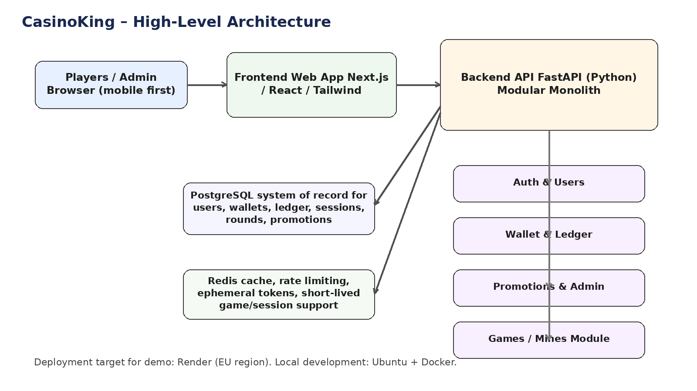
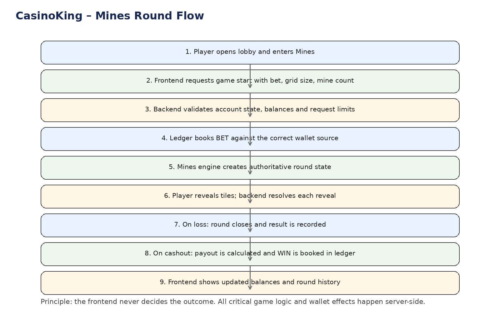
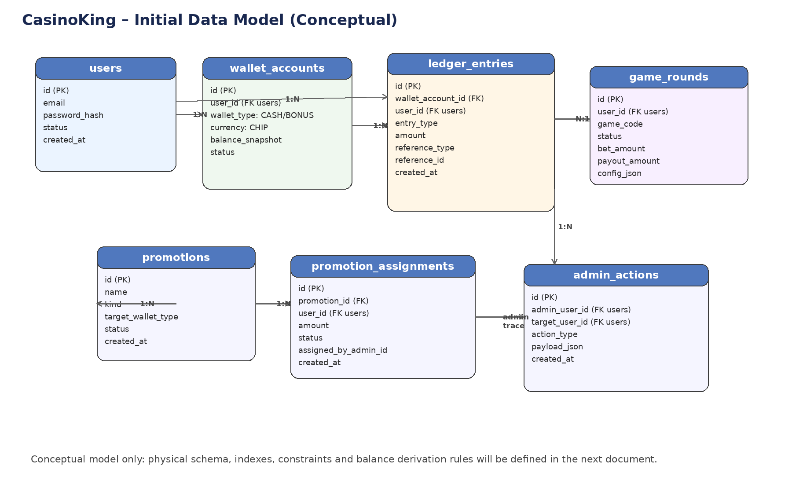

# CasinoKing
Documento 03

Fondazioni, architettura tecnica iniziale,
schema dati concettuale e prime API

| Tipo documento | Base condivisibile con sviluppatori |
| --- | --- |
| Obiettivo | Definire il punto di partenza ufficiale del progetto |
| Stato | Versione iniziale – doppio livello: spiegazione + sezione tecnica |
| Ambito | Demo privata con 1 gioco proprietario (Mines) |

## 1. Executive summary

Questo documento raccoglie in forma ordinata le conclusioni già prese per CasinoKing. Non descrive lo sviluppo operativo passo-passo; definisce invece la teoria di base, le scelte architetturali iniziali, i confini dell’MVP, la strategia cloud, il modello dati concettuale e una prima traccia di API.

### 1.1 Decisioni già fissate

- Il progetto parte come demo reale, non come mockup.
- Lo scope iniziale è casino only, con accesso privato e 1 gioco proprietario: Mines.
- I giocatori ricevono 1000 chip iniziali; esistono due wallet distinti: Cash Chips e Bonus Chips.
- Il backend è authoritative: il frontend non decide risultati, vincite o saldi.
- Lo stack iniziale consigliato è Next.js + FastAPI + PostgreSQL + Redis + Docker.
- La strategia architetturale è modular monolith, pronta a separarsi in futuro.
- Il cloud iniziale scelto a livello teorico è Render in regione europea.

### 1.2 Fatti, ipotesi, dubbi aperti

| Fatti | Ipotesi | Dubbi aperti |
| --- | --- | --- |
| MVP privato con password globale, registrazione email/password e reset password base. | Il sistema potrà evolvere in piattaforma con più giochi e integrazione esterna. | Email verification sì/no da decidere quando verrà definita la UX account. |
| Render UE è una base ragionevole per costi e semplicità. | Alcuni moduli del modular monolith potranno essere estratti in servizi separati. | Strategia futura di embedding giochi: iframe, SDK JS o API da definire. |
| Il primo gioco è Mines con griglie configurabili e numero mine configurabile. | Il gioco Mines potrà diventare un sottoprogetto autonomo. | Roadmap futura per crypto, KYC, operator roles e provider esterni non rientra nell’MVP. |

## 2. Scope dell’MVP

### 2.1 Spiegazione semplice

La prima versione deve sembrare un casino vero, ma con limiti volontari per mantenere semplicità, controllo tecnico e costi bassi. L’utente entra nel sito tramite una password globale, si registra con email e password, riceve 1000 chip iniziali, entra nella lobby, apre Mines e può giocare con chip finte. L’admin può accreditare chip o bonus manualmente e vedere lo storico base.

### 2.2 Include / non include

| Dentro l’MVP | Fuori dall’MVP |
| --- | --- |
| Accesso protetto da password globale | Soldi veri |
| Registrazione email + password | Crypto reale |
| Login / logout / reset password base | KYC / AML / geolocalizzazione regolatoria |
| Wallet Cash Chips + Bonus Chips | Slot, sportsbook, plinko, provider esterni |
| Accredito iniziale automatico di 1000 chip | WordPress nel core di piattaforma |
| 1 gioco: Mines | Multi-country e multi-brand |
| Promo manuali da admin | Tornei / VIP avanzato / promo automatiche complesse |
| Storico giocate e transazioni |  |
| Back office base solo per admin |  |

### 2.3 Ruoli iniziali

| Ruolo | Cosa fa | Note |
| --- | --- | --- |
| Player | Si registra, vede saldi, gioca a Mines, consulta storico base. | Utente finale privato: la demo non è pubblica. |
| Admin | Gestisce utenti, accredita cash/bonus, vede storico e report base. | Per ora usato solo dal proprietario del progetto. |
| System | Valida regole, aggiorna ledger, chiude round, conserva audit. | Ruolo concettuale, non umano. |

## 3. Stack tecnologico e strategia cloud

### 3.1 Spiegazione semplice

La direzione scelta privilegia open source, costi contenuti e portabilità. L’idea non è usare troppi servizi “magici” da subito: meglio uno stack classico e comprensibile. Per questo il progetto parte con frontend web in Next.js, backend in FastAPI, database PostgreSQL, Redis per supporto e Docker per sviluppo locale. La demo viene pensata per il cloud, ma senza complessità da grande enterprise.

### 3.2 Scelte e motivazioni

| Area | Scelta | Perché | Alternative considerate |
| --- | --- | --- | --- |
| Frontend | Next.js / React / Tailwind | Mobile first, adatto a lobby, auth, admin e UI gioco. | App native o WordPress come core: non scelti. |
| Backend | FastAPI (Python) | Buon equilibrio tra chiarezza, velocità e controllo tecnico. | Firebase functions o backend gestiti: scartati come base. |
| Database | PostgreSQL | Ottimo per ledger, integrità, relazioni e reporting. | Firestore/Firebase meno adatto a logica transazionale. |
| Supporto | Redis | Utile per cache, token, rate limiting e strutture temporanee. | Si può anche introdurre dopo, ma conviene prevederlo. |
| Container | Docker | Ambiente riproducibile in locale e portabile nel cloud. | Setup locale senza container: meno robusto. |
| Cloud demo | Render (UE) | Semplice, costo leggibile, adatto a demo tecnica controllata. | AWS/GCP troppo complessi per la fase iniziale. |

### 3.3 Costi indicativi iniziali

Stima ad alto livello, non preventivo definitivo.

| Voce | Range mensile stimato | Commento |
| --- | --- | --- |
| Backend app | 7–15 € | Dipende da piano e risorse minime. |
| Database PostgreSQL | 7–20 € | Per demo iniziale dovrebbe rientrare nel budget. |
| Frontend | 0–10 € | Può stare su piano gratuito o molto economico. |
| Redis | 5–10 € | Eventualmente introducibile con gradualità. |
| Totale target | 20–40 € | Compatibile con budget 30–50 €/mese. |

### 3.4 Latenza e regione

Per la demo la regione consigliata è Europa. Dall’Italia l’esperienza sarà più fluida; dall’Australia la latenza sarà più alta, ma per un gioco turn-based come Mines non è un problema critico. La multi-region non è necessaria nell’MVP.

## 4. Architettura high level

### 4.1 Spiegazione semplice

L’architettura è organizzata in un frontend web, un backend centrale e due componenti dati: PostgreSQL e Redis. Il backend contiene moduli interni separati per auth, wallet, ledger, promotions, admin e giochi. Mines vive come modulo gioco separabile, ma inizialmente integrato nella stessa codebase.

### 4.2 Diagramma generale

Figura 1 – Architettura high level della demo.

### 4.3 Modular monolith: significato pratico

La piattaforma non parte con microservizi veri. Parte con un solo backend, ma internamente diviso in macro-moduli. Questo riduce la complessità, mantiene il controllo tecnico e prepara una separazione futura dove servirà davvero.

| Scelta | Vantaggio | Rischio gestito |
| --- | --- | --- |
| Modular monolith | Più semplice da sviluppare, testare e documentare. | Evita complessità prematura da microservizi. |
| Confini chiari tra moduli | Facilita estrazione futura di giochi o servizi. | Riduce il rischio di monolite “confuso”. |
| Backend authoritative | Protegge wallet, round e logica critica. | Evita manipolazione lato client. |

## 5. Moduli backend

### 5.1 Spiegazione semplice

I moduli backend sono le aree logiche che dividono le responsabilità. Ogni modulo deve avere confini chiari, modelli dati propri dove ha senso e API interne ben definite. Il ledger è il cuore transazionale della piattaforma.

| Modulo | Responsabilità principale | Dati principali | Note |
| --- | --- | --- | --- |
| auth | Registrazione, login, reset password, sessioni/token. | user credentials, reset tokens | Da subito con password hashing serio. |
| users | Profilo utente, stato account, metadata base. | users | Separato concettualmente da auth. |
| wallet | Vista dei saldi cash/bonus per utente. | wallet accounts, balance snapshots | Non deve aggiornare saldi “a mano”. |
| ledger | Registro di tutte le operazioni economiche. | ledger entries | Sistema of record dei movimenti. |
| promotions | Creazione e assegnazione bonus/promo manuali. | promotions, assignments | Base ora; più sofisticato dopo. |
| games | Orchestrazione round, avvio sessioni, routing giochi. | game rounds, game configs | Mines passa da qui. |
| admin | Azioni manuali di back office. | admin actions, audit | Solo admin owner nella prima fase. |
| reporting | Query e sintesi operative. | derived views / reports | Inizialmente semplice. |

### 5.2 Principio ledger-first

Regola centrale: il saldo non si modifica direttamente. Ogni cambiamento economico nasce da una o più scritture di ledger. Il saldo è una vista derivata o una snapshot coerente con il ledger.

- Esempi:
  - +1000 signup grant
  - -10 bet on round start
  - +25 win on cashout
  - -50 manual admin adjustment con audit trail

## 6. Modulo gioco: Mines

### 6.1 Spiegazione semplice

Mines è il primo gioco proprietario e viene trattato come sottoprogetto logico. Anche se all’inizio vive nello stesso repository della piattaforma, deve essere progettato come componente separabile: matematica, backend e frontend dedicati.

### 6.2 Decisioni specifiche già prese

- Gioco più evoluto del minimo: non solo demo statica.
- Configurabile per numero mine.
- Configurabile per dimensione griglia: 9, 16, 25, 36, 49.
- Cashout manuale previsto dal design di gioco.
- Storico round e reporting mani/round da prevedere lato backend.

### 6.3 Flusso round

Figura 2 – Flusso logico di un round Mines.

### 6.4 Struttura logica del sottoprogetto

| Parte | Contenuto | Perché separarla |
| --- | --- | --- |
| math | probabilità, payout tables, RTP, configurazioni | Consente controllo formale e test matematici. |
| backend | motore round, validazioni, cashout, reporting round | Il risultato deve essere authoritative. |
| frontend | board, reveal, UX, animazioni, saldo in tempo reale | La UI può evolvere senza toccare la matematica. |

## 7. Modello dati concettuale iniziale

### 7.1 Spiegazione semplice

Il database deve essere relazionale perché il progetto vive di account, wallet, round, promozioni e soprattutto ledger. Il diagramma seguente non è lo schema fisico definitivo, ma mostra le entità chiave che sostengono l’MVP.

### 7.2 Diagramma concettuale

Figura 3 – Modello dati concettuale iniziale.

### 7.3 Tabelle principali da prevedere

| Tabella | Scopo | Campi chiave | Osservazioni |
| --- | --- | --- | --- |
| users | Identità applicativa utente | id, email, status, created_at | Profilo e stato account. |
| wallet_accounts | Un wallet per tipo per utente | id, user_id, wallet_type, currency | Almeno CASH e BONUS. |
| ledger_entries | Registro movimenti | id, wallet_account_id, entry_type, amount, reference_type/id | Cuore transazionale. |
| game_rounds | Round di gioco | id, user_id, game_code, status, bet_amount, payout_amount | Round authoritative. |
| promotions | Definizione promo | id, name, kind, target_wallet_type, status | Per promo manuali iniziali. |
| promotion_assignments | Assegnazione promo a utente | promotion_id, user_id, amount, status | Traccia chi ha ricevuto cosa. |
| admin_actions | Audit azioni admin | admin_user_id, target_user_id, action_type | Fondamentale per back office. |

### 7.4 Regole dati da preservare

- Ogni wallet appartiene a un solo utente e a un solo tipo logico.
- Ogni scrittura di ledger deve essere riconducibile a una causa (signup, bet, win, promo, admin action).
- Ogni round deve poter essere collegato alle scritture di ledger che lo hanno generato.
- Le operazioni admin che impattano saldi o stato account devono lasciare audit trail.

## 8. Prime API candidate

### 8.1 Spiegazione semplice

Questa sezione non è ancora il contratto API definitivo. È una prima mappa di endpoint da usare come base per l’analisi tecnica. Le API devono essere chiare, poche e coerenti con i moduli del backend.

| Area | Endpoint candidato | Uso | Note |
| --- | --- | --- | --- |
| Auth | POST /auth/register | Crea account con email/password. | Accesso al sito già filtrato dalla site password. |
| Auth | POST /auth/login | Login utente. | Per demo iniziale può usare session/JWT semplice. |
| Auth | POST /auth/request-password-reset | Invia reset password. | Email reale da impostare in fase successiva. |
| Wallet | GET /wallet | Restituisce saldi cash e bonus. | Vista giocatore. |
| Games / Mines | POST /games/mines/start | Apre round con bet, grid_size, mine_count. | Valida limiti e saldo. |
| Games / Mines | POST /games/mines/reveal | Rivela una tile. | Il backend risolve outcome. |
| Games / Mines | POST /games/mines/cashout | Chiude round in profitto. | Genera win in ledger. |
| Admin | GET /admin/users | Lista utenti per back office. | Solo ruolo admin. |
| Admin | POST /admin/wallet-adjustment | Accredito/storno cash o bonus. | Deve scrivere nel ledger. |
| Admin | POST /admin/promotions/assign | Assegna bonus manuale. | Con audit action. |
| Reporting | GET /admin/reports/overview | Report base di round e movimenti. | MVP semplice. |

### 8.2 Esempi di payload concettuali

Avvio round Mines:

{
"bet_amount": 10,
"wallet_type": "CASH",
"grid_size": 25,
"mine_count": 3
}

Assegnazione bonus manuale:

{
"user_id": "usr_123",
"wallet_type": "BONUS",
"amount": 250,
"reason": "manual promotional credit"
}

## 9. Ambienti, repository e percorso operativo

### 9.1 Ambiente locale

Lo sviluppo iniziale avviene in locale su Ubuntu con Docker. Il NAS con Docker non è l’ambiente consigliato per iniziare a sviluppare: potrà essere utile più avanti per test o ambienti sempre accesi, ma non come base principale di lavoro.

### 9.2 Repository

La scelta corrente è partire con un repository principale unico, organizzato in modo da poter estrarre il gioco Mines in repository dedicata quando sarà stabile.

| Percorso consigliato | Note |
| --- | --- |
| casinoking-platform/backend | Backend FastAPI e moduli core |
| casinoking-platform/frontend | Frontend web Next.js |
| casinoking-platform/games/mines | Sottoprogetto gioco strutturato in math/backend/frontend |
| casinoking-platform/infra | Docker, config, deploy notes |
| casinoking-platform/docs | Documentazione di progetto |

### 9.3 Roadmap documentale immediata

- Documento 03 (questo): fondazioni + architettura + schema dati + API candidate.
- Documento 04: schema database più dettagliato, vincoli e regole ledger.
- Documento 05: specifica funzionale e matematica del gioco Mines.
- Documento 06: design back office, ruoli admin futuri e permissions.

## 10. Conclusione

CasinoKing parte con una direzione tecnica coerente: demo reale, stack open source, cloud semplice, backend authoritative, ledger-first e modular monolith. Questo documento non chiude il progetto; fissa però una base ufficiale abbastanza solida da essere condivisa con sviluppatori e usata come riferimento accademico e progettuale.

Prossimo passaggio consigliato: dettagliare lo schema database e le regole del ledger, perché sono il punto più sensibile dell’intera piattaforma.
